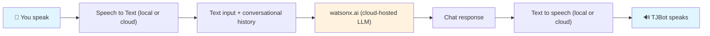

# Chat with TJ

> :robot: :microphone: Build a talking robot with watsonx.ai!

This recipe uses IBM's [watsonx.ai](https://www.ibm.com/products/watsonx-ai) service to turn TJBot into a conversational partner.

## Requirements

[](https://www.raspberrypi.org/)

-orange)
[](https://nodejs.org/)

> ⚠️ We recommend a Raspberry Pi 4+ for local TTS synthesis. The recipe will work on other Raspberry Pi hardware using one of the cloud-based TTS backends.

## How it Works

IBM's [watsonx.ai](https://www.ibm.com/products/watsonx-ai) service is an inference platform for large language models (LLMs). This recipe demonstrates how to use this service to create a conversational partner. TJBot listens to your voice using its microphone and uses a speech-to-text service to convert your speech into text. Next, that text is passed to an LLM to produce TJBot's chat response to you. Finally, that chat response is converted to audio using a text-to-speech service.

Here is a picture of how this works.



## Configure

> 🤖 Prerequisite: Make sure you have configured your Raspberry Pi for TJBot by following the [bootstrap instructions](https://github.com/ibmtjbot/tjbot/tree/master/bootstrap).

As this recipe demonstrates how to use IBM's [watsonx.ai](https://www.ibm.com/products/watsonx-ai) service, you will need to register for an IBM Cloud account, obtain an IBM Cloud API key, and create a watsonx.ai project.

### Register for an IBM Cloud account

If you do not already have an IBM Cloud account, [register for one](https://cloud.ibm.com/).

### Obtain an IBM Cloud API key

Create an IBM Cloud IAM API key by following these steps:

1. Visit the [IBM Cloud IAM API Keys](https://cloud.ibm.com/iam/apikeys) page.
2. Click the blue "Create" button.
3. Type in a name for your API key and click "Create" (we recommend "TJBot"!)
4. Copy the API key. **Important**: Once you close the dialog, you will not be able to retrieve this API key in the future; instead, you will need to revoke the key and generate a new one.

Once you have your API key, first make a copy of the `ibm-credentials.env` file.

```sh
cp ibm-credentials.sample.env ibm-credentials.env
```

Then edit the file to add your API key.

```env
WATSONX_AI_APIKEY= # FILL IN WITH YOUR IBM CLOUD API KEY
```

### Create a watsonx.ai project

Create a watsonx.ai project by following these steps:

1. Launch [watsonx.ai](https://dataplatform.cloud.ibm.com/wx/home?context=wx) and sign in.
2. Click the "+" sign in the "Projects" section and follow the steps to create a new project.
3. Open the project and click the "Manage" tab.
4. From the "General" section copy your `projectId`. Save this for later.
5. Next click "Services & integrations".
6. Click "Associate service" and select the "Watson Machine Learning" service.
7. Click "Associate" at the bottom right.
8. Find your `serviceUrl` by visiting the [API documentation](https://cloud.ibm.com/apidocs/machine-learning) and locating the section titled "Endpoint URLs." Copy the URL that corresponds to the region in which you created your Watson Machine Learning service, you will need it in the next step.

Once you have the `projectId` and `serviceUrl`, edit the `recipe.toml` file and paste them in:

```toml
projectId = <your watsonx.ai projectId>
serviceUrl = <your watsonx.ai serviceUrl>
```

> 🌎 In the United States, the watsonx.ai `serviceUrl` is `https://us-south.ml.cloud.ibm.com`.

### (Optional) Shine while speaking

Have an LED hooked up to your TJBot? Update your `recipe.toml` file to indicate which kind of LED you have by setting one (or both) of these values to `true`:

```toml
useNeoPixelLED = false     # set to true if using a NeoPixel LED
useCommonAnodeLED = false  # set to true if using a Common Anode LED
```

Then, TJBot will shine green when listening, orange when processing your speech, and yellow when speaking!

## Run

You can run this recipe using the `tjbot` command or you can run it manually using `mise`.

### Run using `tjbot run`

Open a Terminal and run the following command from anywhere on your system:

```sh
tjbot run chat_with_tj
```

> 💡 `tjbot` invokes `mise` under the hood, which will automatically install any required software dependencies before running the recipe.

### Run manually using `mise`

Open a Terminal and navigate to this recipe's directory. For example, if this recipe is located in `~/.tjbot/recipes/chat_with_tj`, then:

```sh
cd ~/.tjbot/recipes/chat_with_tj
```

Install the recipe's dependencies:

```sh
mise install
```

Then, run the recipe:

```sh
mise run start
```

## Customize

### Customization 1: Try a different LLM

Want to try a different large language model? Check out the [full list of large language models](https://dataplatform.cloud.ibm.com/docs/content/wsj/analyze-data/fm-api-model-ids.html?context=wx&audience=wdp) supported by watsonx.ai. and then change the `modelId` parameter in your `recipe.toml` file.

```toml
modelId = 'meta-llama/llama-3-70b-instruct'
```

### Customization 2: Change the LLM parameters

You can also try changing different [model parameters](https://dataplatform.cloud.ibm.com/docs/content/wsj/analyze-data/fm-model-parameters.html?context=wx&audience=wdp), such as the `modelDecodingMethod` and the `modelTemperature` to change how TJBot responds to you.

## Troubleshoot

If you are having difficulties in making your TJBot work, please see the [troubleshooting guide](https://github.com/tjbot-ce/tjbot/wiki/Troubleshooting-TJBot).

## Contribute

If you would like to contribute to TJBot, please see the [contributor's guide](https://github.com/tjbot-ce/tjbot/wiki/Contributing-to-TJBot).

## License

This project is licensed under Apache 2.0. Full license text is available in [LICENSE](../../LICENSE).
